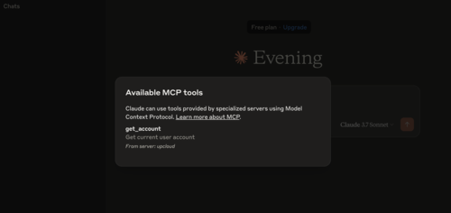
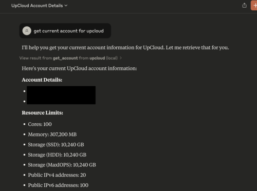

# Upcloud MCP Server

## Work in progress!!!

This is a work in progress and not yet ready for any type of use. Please check back later for updates.

## Overview

The Upcloud MCP Server is a [Model Context Protocol (MCP)](https://modelcontextprotocol.io/introduction)
server that provides seamless integration with Upcloud APIs, enabling advanced
automation and interaction capabilities for developers and tools.
The idea comes from [Github MCP server](https://github.com/github/github-mcp-server/)

## Use Cases

- Extracting and analyzing data from Upcloud services.
- Building AI powered tools and applications that interact with Upcloud's ecosystem.

## Prerequisites

//TODO

## Installation

```sh
go build cmd/upcloud-mcp-server
```

and move the binary to your `bin` location

### Usage with Claude Desktop

There is a `cloud_desktop_config.json` sample file.
You will need to populate `UPCLOUD_USERNAME` and `UPCLOUD_PASSWORD` env variables.
Move this file to Claude configuration directory.
On Mac: `~/Library/Application\ Support/Claude/claude_desktop_config.json`
On Windows: `AppData\Claude\claude_desktop_config.json`




## Tools

### Account

- **get_account** - Get account of current user
- **get_account_details** - Get account details by username
  - `username`: Account username (string, required)
- **get_account_list** - Get account list

### Database

- **get_database** - Get managed database by uuid
  - `uuid`: Database UUID (string, required)

### Server

- **get_servers** - Get servers
- **get_server_details** - Get server details
  - `uuid`: Server UUID (string, required)

## License

This project is licensed under the terms of the MIT open source license. Please refer to [MIT](./LICENSE) for the full terms.
